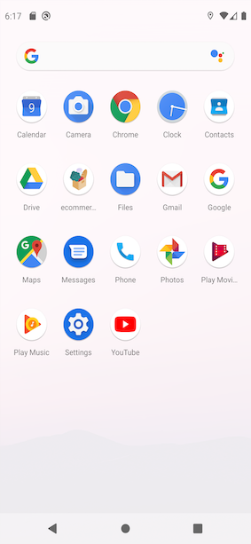

# Generic e-commerce react native project

A cross-platform sample delivery project made from the ground up that works both on iOS and Android. This project can be connected to any backend application by little tweaks.

Significant libraries used within the project:
- react-navigation
- redux
- redux-saga
- react-native-paper
- react-native-vector-icons
- reactotron
- typescript
- formik
- i18next
- react-native-dark-mode
- react-native-snap-carousel
- react-native-splash-screen
- react-native-swipe-list-view

# Quick Start

Run `npm i` for node modules installation

Run `cd ios` on the root folder

Run `pod install` for installing cocoapods ios dependencies

Run `npm run ios`

Run `npm run android`

## Some Screenshots
 #### Home Page [iOS - English - Dark Mode]
 #### Home Page [Android - Turkish - Light Mode]
 
 

 #### Profile Page [iOS - English - Dark Mode]
 #### Profile Page [Android - Turkish - Light Mode]
 
 
 
 #### App Icon [iOS - English - Dark Mode] 
 #### App Icon [Android - Turkish - Light Mode]
  
  